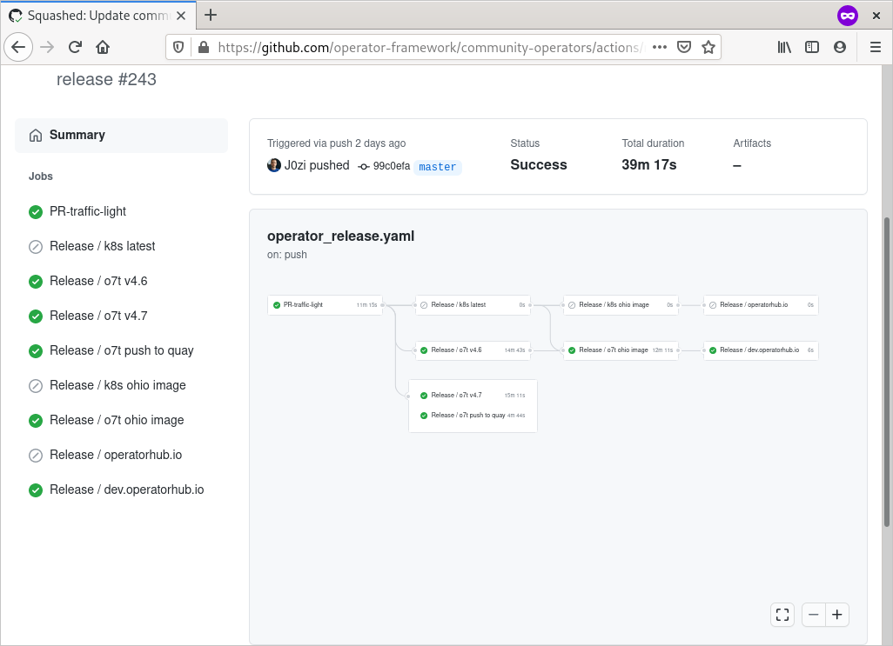

# Operator release
## Operator release workflow

[Release workflow](https://github.com/operator-framework/community-operators/actions?query=workflow%3A%22Operator+release%22) contains all jobs. This can be found in `Actions` tab of the project.

When an operator is merged to the master following scenarios will happen: 
## For a k8s case (upstream-community-operators)

1. Push to quay (to support old app registry)
1. Build index image for k8s
1. Build image for operatorhub.io page
1. Deploy operatorhub.io page

## For an Openshift case (community-operators)

1. Push to quay (to support old app registry)
1. Build index image for different Openshift versions (v4.6 and v4.7 in this case) and multiarch image is also produced.
1. Build image for dev.operatorhub.io page (for development purposes only)
1. Deploy dev.operatorhub.io page (for development purposes only)

## Operator is published
After this process, your operator will be published.

### Index image location

For Openshift: 


- `registry.redhat.io/redhat/community-operator-index:{{ v }}`


!!! note
    `registry.redhat.io/redhat/community-operator-index:latest` - this is a clone of `v4.6` from historical reasons as it always was a clone of `v4.6`. Will be deprecated in the future.

For Kubernetes:

- `quay.io/operatorhubio/catalog:latest`

### Bundle images location
For Openshift:

[`quay.io/openshift-community-operators/`](https://quay.io/organization/openshift-community-operators)

For Kubernetes:

[`quay.io/operatorhubio/`](https://quay.io/organization/operatorhubio)
