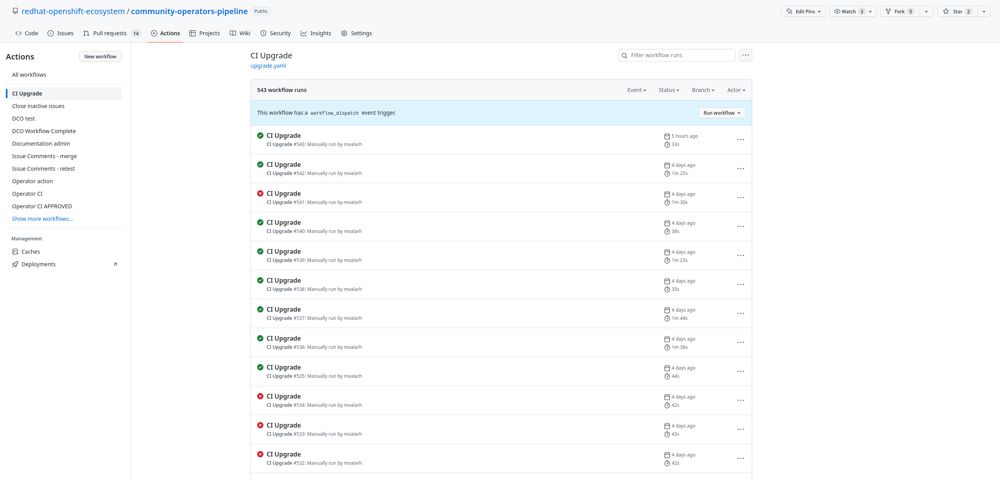

## Secrets

Screenshot of GitHub action secrets

The table is explaining  

|Name|Description|
|----|----|
|`ACTION_MONITORING_SLACK`| Slack webhook credentials |
|`FRAMEWORK_MERGE`| GitHub action token for `framework-automation` user to be able to automerge |
|`GH_TOKEN`| GitHub action token for `framework-automation` to produce statistics |
|`IIB_INPUT_REGISTRY_TOKEN`| Token for user `$IIB_INPUT_REGISTRY_USER` to be able to access `registry.redhat.io` |
|`PREPARE_INDEX_API_TOKEN`| Quay application Token (user: `$oauth`) used for preparing temporary index for prow jobs |
|`REGISTRY_MIRROR_PW`| Token for user `$REGISTRY_MIRROR_USER` to be able to push to production (mirror) index|
|`REGISTRY_RELEASE_API_TOKEN`| Quay application Token (user: `$oauth`) used for pushing to release index |
|`REPO_GHA_PAT`| GitHub access token (deprecated)|
|`OHIO_REGISTRY_TOKEN`| Quay application token (user: `$oauth`) to push index image used for `operatorhub.io` web page|
|`SIGNATURE_WEBHOOK_PASSWD`| Index signrature password   |
|`SIGNATURE_WEBHOOK_REQUESTER_EMAIL`| Index signrature requester email |
|`SIGNATURE_WEBHOOK_SECRET`| Index signrature secret |

## Generate Github Action workflows

!!! note
    On newly created projects one should copy the file ([upgrade.yaml](https://github.com/redhat-openshift-ecosystem/community-operators-pipeline/blob/main/.github/workflows/upgrade.yaml)) to `.github/workflows/upgrade.yaml` and push it into `main` branch so `CI Upgrade` workflow is enabled in the `Actions` tab in the GitHub project.

After the directory and configurations are in place one can generate all workflows by running [Upgrade Action](https://github.com/redhat-openshift-ecosystem/community-operators-pipeline/actions/workflows/upgrade.yaml) from the configured project. More details one can find [here](/project/maintain/#project-upgrade)

One can verify `Upgrade CI` GitHub Action. See screenshot below

